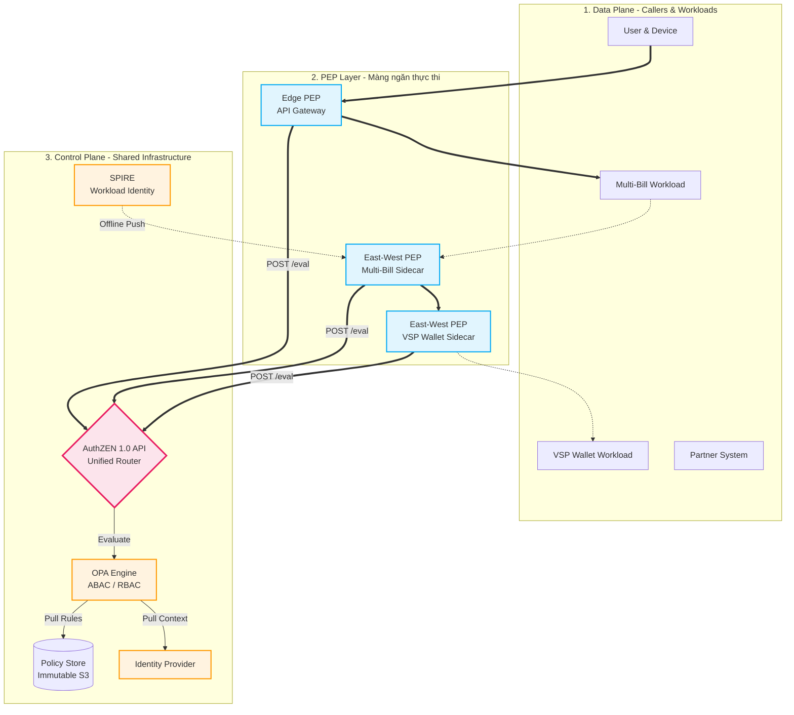

# Zero Trust — Thiết kế Chi tiết Hệ thống Authorization (v3)

> **Trạng thái:** Implementation Ready
> **Mục tiêu:** Định nghĩa hợp đồng dữ liệu (Data Contract), kiến trúc luồng (Sequence) và chiến lược triển khai cho hệ thống Authorization dùng chung của VSP System.
> **Tiêu chuẩn Tham chiếu:** OpenID AuthZEN 1.0 API, NIST Zero Trust Architecture.

---

## 1. Tổng quan Kiến trúc (3 Mặt Phẳng)

Hệ thống được chia làm 3 mặt phẳng tách biệt nghiêm ngặt. PEP chỉ làm nhiệm vụ thực thi (Enforcement), PDP tập trung ra quyết định (Decision). AuthZEN API đóng vai trò là "Facade" che giấu độ phức tạp của các Policy Engine bên trong.



## 2. Mô hình Đánh giá Nhiều Lớp tại PEP (L0/L1/L2)

PEP không đẩy mọi thứ lên PDP. Quá trình kiểm tra quyền diễn ra theo dạng phễu (Ladder) từ Rẻ/Nhanh đến Đắt/Chính xác:

- **L0 (Channel/Peer - Mức Mạng):** Thực thi nội bộ tại proxy/sidecar. Kiểm tra mTLS, xác minh chứng chỉ SVID của service gọi tới. Nếu sai → Drop connection ngay lập tức.
- **L1 (Invocation - Mức Route):** Thực thi nội bộ. Kiểm tra Caller có được phép gọi API/gRPC Route này không (Route Guard).
- **L2 (Resource/Action - Mức Nghiệp vụ):** Chạm tới PDP. Tổng hợp Context, Subject, Payload (ví dụ: amount) gửi qua AuthZEN API để lấy quyết định.

## 3. Hợp đồng Dữ liệu AuthZEN (VSP Standard Contract)

Dù AuthZEN 1.0 cho phép tự do định nghĩa `properties`, VSP System áp dụng bộ quy tắc nội bộ sau để đảm bảo OPA có thể phân loại và xử lý chính xác.

### 3.1. Quy tắc Naming Convention

- **Subject Type:** `user` hoặc `workload`.
- **Resource Type:** `<domain>:<entity>` (VD: `wallet:account`, `bill:invoice`).
- **Action Name:** `<domain>:<action>` (VD: `wallet:settle`, `bill:pay`).

### 3.2. Cấu trúc Request Tiêu Chuẩn

```json
{
  "subject": {
    "type": "user",
    "id": "<user_id>",
    "properties": {
      "auth_assurance_level": "<AAL1|AAL2|AAL3>",
      "act": {
        "type": "workload",
        "id": "spiffe://vsp.local/ns/billing/sa/multi-bill-svc"
      }
    }
  },
  "action": {
    "name": "<domain>:<action>",
    "properties": { "method": "<HTTP/gRPC_METHOD>" }
  },
  "resource": {
    "type": "<domain>:<entity>",
    "id": "<entity_id>",
    "properties": {
      "amount": 5000000,
      "currency": "VND"
    }
  },
  "context": {
    "authz_profile": "<edge|east_west|partner>",
    "correlation_id": "<trace_id>",
    "pep": { "id": "<pep_identifier>" }
  }
}
```

### 3.3. Cấu trúc Response Tiêu Chuẩn

```json
{
  "decision": false,
  "context": {
    "decision_token": { "value": "<token>", "ttl_seconds": 300 },
    "obligations": [
      { "type": "step_up", "details": { "required_acr": "AAL3", "method": "mfa" } },
      { "type": "log", "details": { "level": "audit_success" } }
    ]
  }
}
```

## 4. Xử lý Obligation Xuyên Chặng (Cross-PEP Step-up)

**Vấn đề:** Các service nằm sâu bên trong (East-West PEP như VSP Core Wallet) không có session với User để bật màn hình nhập OTP khi PDP yêu cầu `step_up`.

**Giải pháp (Bubble-up Pattern):**

1. **Chặn tại đích:** Khi VSP Core Wallet PEP nhận `decision: false` kèm `obligation: step_up` từ PDP, nó KHÔNG tự xử lý.
2. **Dội ngược lỗi:** Nó trả về HTTP 403 hoặc gRPC DENIED cho Multi-Bill Service, đính kèm custom header `X-Step-Up-Required`.
3. **Bắt tại nguồn:** Multi-Bill dội ngược lỗi này về API Gateway. API Gateway (Edge PEP) đọc header, phiên dịch thành HTTP 401 Challenge để kích hoạt UI bắt User nhập MFA.
4. **Thử lại với Elevated Token:** Sau khi xác thực MFA, Gateway gửi request AuthZEN mới, nhận `decision_token` chuẩn AAL3 và truyền lại chuỗi giao dịch. VSP Core Wallet kiểm tra token hợp lệ và cho qua.

## 5. Chiến lược Triển khai & Mở rộng OPA (Policy Lifecycle)

Để tránh "vỡ trận" khi số lượng PEP tăng lên, Policy của hệ thống được quản lý theo mô hình Tách rời (Decoupled) và Hướng dữ liệu (Data-driven).

### 5.1. Cấu trúc Policy Phân Cấp (Hierarchical Rego)

Tuyệt đối không viết Policy theo từng PEP cụ thể. OPA xử lý request bằng cách định tuyến theo payload:

- `/global/...`: Validation schema AuthZEN chuẩn.
- `/profiles/<profile_name>.rego`: Validate context theo chặng (Edge phải có IP, East-West phải có `act`).
- `/domain/<resource_type>.rego`: Logic nghiệp vụ (Ví dụ: `wallet:settle` > 5M VND thì đòi AAL3).

### 5.2. Data-Driven Requirements

Yêu cầu về thuộc tính (Schema requirement) được tách khỏi logic code Rego, lưu trong một file tĩnh `data.json`.

```json
{
  "required_attributes": {
    "wallet:settle": ["amount", "currency"]
  }
}
```

Một rule Rego dùng chung sẽ quét file này. Nếu PEP truyền thiếu `amount`, OPA lập tức từ chối request. Khi cần thêm service, kỹ sư chỉ cập nhật file JSON, không chạm vào code lõi.

### 5.3. GitOps & Immutable Storage CI/CD

1. Code Rego và Data được quản lý trên Git Repo.
2. Mọi thay đổi (Pull Request) phải vượt qua Automated Tests (Fitness functions) để đảm bảo không phá vỡ logic phân quyền hiện tại.
3. Khi CI pass, hệ thống compile OPA Bundle.
4. **Bảo vệ toàn vẹn lịch sử:** Các file Bundle này được đẩy lên các S3 result buckets. Theo chuẩn kiến trúc, các bucket này phải được cấu hình chặt chẽ để ngăn chặn overwrite hoặc override, đảm bảo versioning luôn toàn vẹn để rollback an toàn hoặc chạy retry jobs khi cần.
5. Các PEP Sidecar hoặc Unified PDP sẽ tự động pull bundle mới nhất về bộ nhớ.

## 6. Kế hoạch Tiếp theo (Next Steps - TBD)

1. **Protobuf Contract:** Thiết kế map schema JSON AuthZEN sang file `.proto` để tối ưu Serialization/Latency cho luồng nội bộ (gRPC).
2. **Dynamic Attributes Cache:** Xây dựng luồng Event-Driven (có thể dùng CAEP) để push trạng thái Session thu hồi hoặc Posture thay đổi thẳng vào bộ nhớ của các Sidecar PEP, tránh việc phải pull liên tục.
3. **Tích hợp ReBAC:** Chuẩn bị interface cho Zanzibar-style Engine để xử lý quyền hạn phức tạp (Graph-based) trong tương lai.
